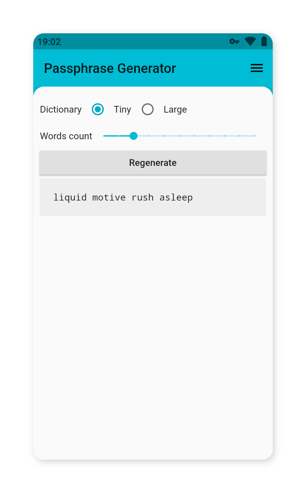

# Passphrase generator

Simple app to generate passphrases inspired by [XKCD comic](https://www.xkcd.com/936/). Built using [Flutter](https://flutter.io).

**Key features:**
* Minimalistic
* Instant loading
* Secure. Does not require Internet permission.
* Free and Open Source

## Downloads
Check out the [releases tab](https://github.com/holykol/passphrase-generator/releases) for pre-built apk files. You can also build the app yourself if you're familiar with Flutter development. I'm considering publishing the app on F-Droid in near future.

## Credits
Thanks [EFF](https://www.eff.org/deeplinks/2016/07/new-wordlists-random-passphrases) for the small dictionary and thanks to [Alan Beale](http://wyrdplay.org/12dicts.html) for the large one.

## License
Released under [WTFPL](./LICENSE)